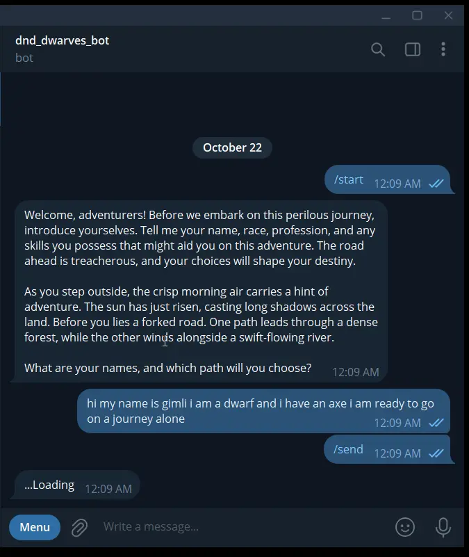

# Dnd_bot (telegram-bot)

### Video preview:

### Server repository:
https://github.com/ghstd/grammy-bot-server

### Description:
Telegram bot that acts as a master in the text game dungeons and dragons, the ai model is used for responses, the bot supports only one session, can be connected to a group with several participants.

### Resources used:
- https://app.netlify.com/functions
- https://api.cohere.ai/v1/chat
- https://render.com
- https://xata.io/ -> Database
